# Comprendre les compilateurs
## Plus simple qu’il n’y paraît!

#### Philippe Vlérick - philippe.vlerick@worldline.com

---
layout: quote
---

# _Qu'est-ce qu'un compilateur?_

> ## un logiciel qui traduit un langage que je comprend en un langage que l'ordinateur comprend.

---
layout: quote
---

# _Plus formelle_

> ## un logiciel qui lit un programme dans un langage - le langage source - et le traduit en un logiciel équivalent dans un autre lagage - le langage cible


<style>
img {display: block; margin: auto; height: 300px}
</style>

---
layout: cover
background: ./img/wizard.png
---

# Les étapes de la compilation

---
layout: fact
---

## Un compilateur exécute une séquence d'étapes qui transforment une représentation du logiciel source en une autre


---
layout: fact
---

## Le résultat de chaque _étape_ est utilisé comme entrée de l'_étape_ suivante

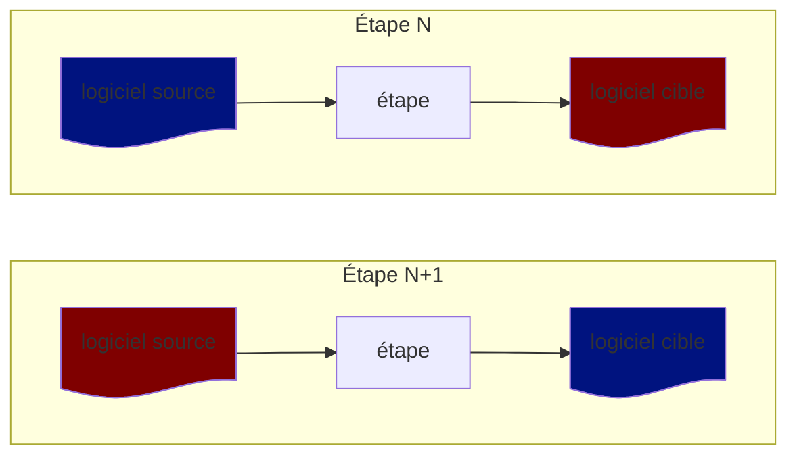

---
layout: fact
--

## Prise individuellement, ces _étapes_ ne sont pas aussi intimidantes

---
layout: cover
background: ./img/wizard.png
---

# Scanning (ou _Lexing_)

---
layout: fact
---

## Consumes Characters, Produces Tokens

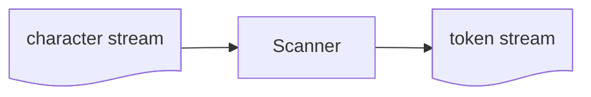

---

# Source Code

```c
char *foo = "bar";
```

---

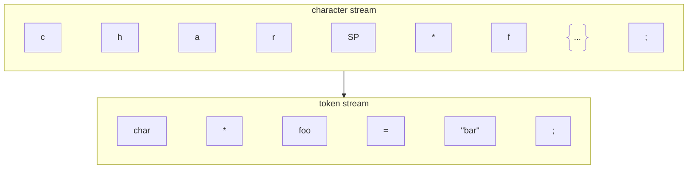

---
layout: cover
background: ./img/wizard.png
---

# Parsing

---
layout: fact
---

## Consumes Token, Produces Abstract Syntax Tree (AST)

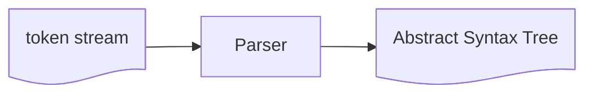

---
layout: fact
---

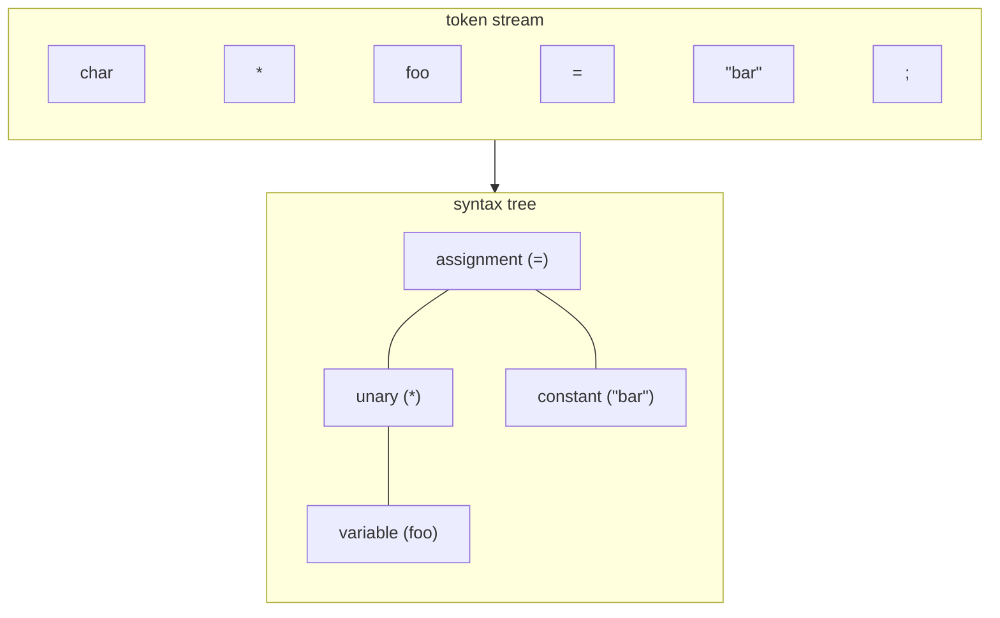

---
layout: cover
background: ./img/wizard.png
---

# _Compiler_ or _Interpreter_?

---
layout: fact
---

## A Compiler _translates_ a program

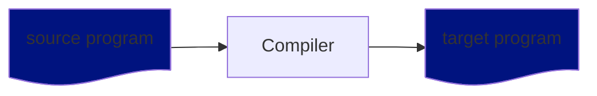

## ...but does not run it

---
layout: fact
---

## An Interpreter _runs_ a program from source

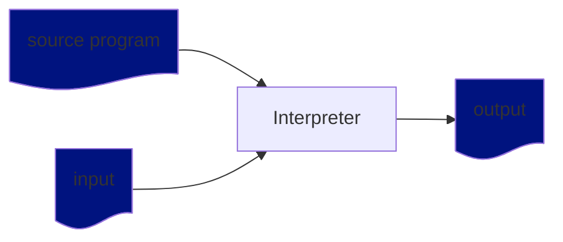

---
layout: cover
background: ./img/wizard.png
---

# Compilers' Structure

---
layout: fact
---

## _Three Phases Design_

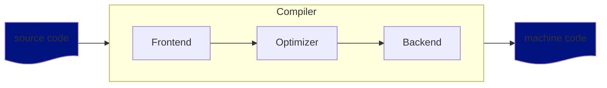

---
layout: normal
---

# Frontend

- Scanning/_Lexing_
- Parsing
- Semantic Analysis
- Conversion to Intermediate Representation

---
layout: normal
---

# Optimizer

- Dead Code Elimination
- Inlining
- Constant Folding
- Constant Propagation
- Loop Unrolling

---
layout: normal
---

# Backend

- Machine Code Generation
  - Target-specific Instructions
  - Target-specific Optimizations

---
layout: fact
---

## LLVM Example

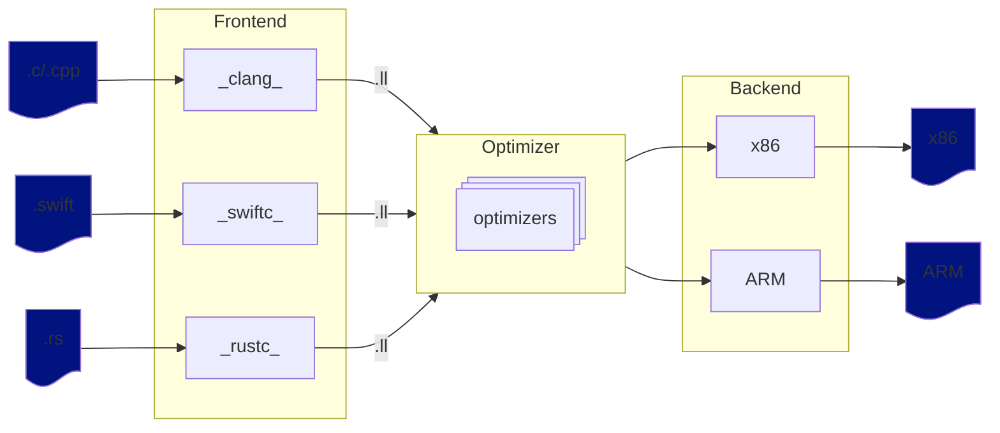

---
layout: fact
---

## JVM Example

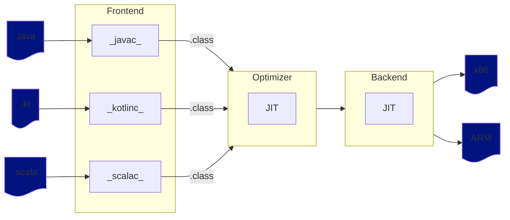

---
layout: cover
background: ./img/wizard.png
---

# Conclusion

---
layout: normal
--- 

# Compilers are Software
- They can be understood one step at the time
- You could write a simple one yourself, there is no magic

---
layout: normal
--- 

# If you want to learn more by doing
- https://craftinginterpreters.com/

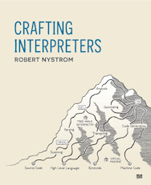
