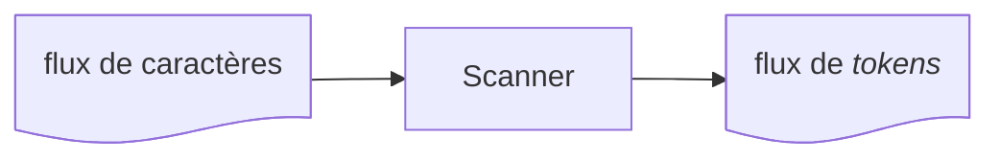

# Comprendre les compilateurs
## Plus simple qu’il n’y paraît!

<br />
<br />

#### Philippe Vlérick - philippe.vlerick@worldline.com


<style>
img {display: block; margin: auto; height: 100px;}
</style>

---
layout: quote
---

# _Qu'est-ce qu'un compilateur?_

> ## un logiciel qui traduit un langage que je comprends en un langage que l'ordinateur comprend.

---
layout: quote
---

# _Plus formelle_

> ## un logiciel qui lit un logiciel dans un langage - le langage source - et le traduit en un logiciel équivalent dans un autre langage - le langage cible


<style>
img {display: block; margin: auto; height: 300px}
</style>

---
layout: cover
background: ./img/wizard.png
---

# Les étapes de la compilation

---
layout: fact
---

## Un compilateur exécute une séquence d'étapes qui transforment une représentation du logiciel source en une autre


---
layout: fact
---

## Le résultat de chaque _étape_ est utilisé comme entrée de l'_étape_ suivante


---
layout: fact
---

## Prise individuellement, ces _étapes_ ne sont pas aussi intimidantes

---
layout: cover
background: ./img/wizard.png
---

# Scanning (ou _Lexing_)

---
layout: fact
---

## Caractères -> _Tokens_



---

# Code source

```csharp
var name = "foo";
```

---


---
layout: cover
background: ./img/wizard.png
---

# Parsing

---
layout: fact
---

## _Tokens_ -> _Abstract Syntax Tree_ (AST)


---
layout: fact
---


---
layout: cover
---

# Demo

---
layout: cover
background: ./img/wizard.png
---

# _Compilateur_ ou _Interpréteur_?

---
layout: fact
---

## Un compilateur _traduit_ un logiciel


## ...mais ne l'exécute pas

---
layout: fact
---

## Un interpréteur _exécute_ un logiciel à partir des sources


---
layout: cover
background: ./img/wizard.png
---

# Structure d'un compilateur

---
layout: fact
---

## _Design en trois phase_


---
layout: normal
---

# Frontend

- Scanning/_Lexing_
- Parsing
- "Desugaring"
- Analyse sémantique
- Conversion en représentation intermédiaire (IR)

---
layout: normal
---

# Optimisateur

- _Dead Code Elimination_
- _Inlining_
- _Constant Folding_
- _Constant Propagation_
- _Loop Unrolling_
- ...

---
layout: normal
---

# Backend

- Génération du code machine
  - Instruction spécifiques à la plateforme cible
  - Optimisations spécifiques à la plateforme cible

---
layout: fact
---

## Exemple: LLVM


---
layout: fact
---

## Exemple: _dotnet_


---
layout: cover
background: ./img/wizard.png
---

# _Desugaring_

---
layout: fact
---

## Transformer des instructions de _haut niveau_ en instructions plus simple (et souvent plus longues) du même langage

---
layout: cover
background: ./img/wizard.png
---

# Optimisations

---
layout: normal
---

- _Constant Folding_
- _Constant Propagation_
- _Dead code elimination_

---
layout: cover
background: ./img/wizard.png
---

# Conclusion

---
layout: normal
--- 

# Les compilateurs sont des logiciels
- Ils peuvent être compris, pas à pas
- Vous pourriez en écrire un vous-même, il n'y a aucune magie

---
layout: normal
--- 

# Pour aller plus loin - en faisant
- https://craftinginterpreters.com/


---
layout: center
---


<style>
img {display: block; margin: auto; height: 300px;}
.slidev-layout {height: 100%; background: #E0E0E0;}
</style>
